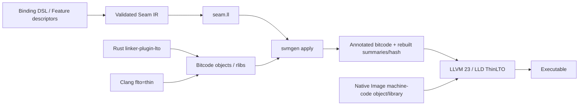

# Applying contracts to the real ThinLTO inputs

The primary integration is **rewrite compiler-produced bitcode before the ThinLTO index is built**. This places the contracts on the actual objects whose callers LLVM optimizes and makes them visible to both local optimization and ThinLTO. Generated declarations supply a portable contract interchange format; they are not an extra link input expected to enrich unrelated objects.



## Why this mechanism

| Mechanism | Role |
| --- | --- |
| Rewriting caller bitcode | Primary path. Attach contracts to matching declarations/definitions and direct call/invoke sites in every participating module. |
| Declaration-only module in the link | Insufficient by itself. ThinLTO is summary-based and does not generally merge arbitrary declarations into every caller module. |
| LLVM importable wrapper bodies | Useful later for ABI adaptation, null checks, constant arguments, status handling, and symbol renaming. Inlining a wrapper can expose its annotated opaque call. Adds a layer that direct contract application does not require. |
| Compiler/LTO pass plugin | Possible future low-copy integration using the same applicator logic. Pre-optimization is the best insertion point; link-time injection needs explicit cache invalidation when external contract files change. |
| Editing machine-code-only objects | Cannot supply an LLVM function body or make LLVM optimize inside Native Image code. Preserve these objects as native implementations. |
| Replacing Native Image with a fake FatLTO object | Incorrect: embedded IR would claim to be the LTO representation of machine code it does not implement. |

This revises the briefing's expectation that a separate declaration module in the final ThinLTO link will automatically enrich callers.

## Implemented applicator

`svmgen apply` invokes `svmgen-llvm`, a small C++ executable linked against LLVM 23. A separate helper keeps LLVM out of the Java native executable and binds the bitcode reader/writer to the production LLVM toolchain.

The helper:

1. Reads generator-produced `seam.ll`, checks its fingerprint metadata, and restricts the accepted attribute vocabulary.
2. Reads LLVM bitcode regardless of `.bc`/`.o` suffix. For regular `.a`/`.rlib` archives, rewrites bitcode members and preserves other member payloads, names, and order. Rebuilds the archive symbol table deterministically.
3. Matches exact symbols and checks target architecture/OS/environment/object format, function type, calling convention, and existing attribute compatibility.
4. Adds approved parameter/function contracts to matching definitions/declarations and their direct call/invoke sites. Indirect calls are not guessed from signature similarity.
5. Verifies modified IR, embeds `!svmgen.applied` with a SHA-256 of the actual contract bytes, rebuilds the module summary, and recomputes the module hash.
6. Commits a separate output file only after validation succeeds. No-match inputs fail, so an ineffective pipeline integration cannot pass silently.

Same-contract application is idempotent. Reapplying a different contract set to already annotated input is rejected: rebuild from the original compiler output to avoid retaining attributes that were removed or weakened. Version 1 expects one consolidated contract module per object/archive.

Thin archives, native-only object rewriting, embedded-bitcode containers, aliases used as contracted symbols, and incompatible ABI forms are rejected. Ordinary native archive members and Rust metadata are preserved. A native-only symbol can still be described; its attributes are attached to declarations/calls in the LLVM callers rather than to machine instructions.

## Build pipeline

Use the **same LLVM 23 toolchain** for Rust/C/C++, the applicator, and LLD. Matching a major version is the initial build guard, not a promise that arbitrary development snapshots are bitcode-compatible. Build the helper inside Elide's hermetic toolchain for production. The repository's local tests used Rust and LLVM reporting 23.1.1.

```sh
# Generator and applicator
LLVM_CONFIG=/hermetic/llvm/bin/llvm-config scripts/build.sh --llvm
build/dist/svmgen generate bindings.seam --out build/seam \
  --target x86_64-unknown-linux-gnu

# C/C++ inputs
/hermetic/llvm/bin/clang -O2 -flto=thin -c caller.c -o build/caller.o
build/dist/svmgen apply --contracts build/seam/seam.ll \
  --input build/caller.o --output build/caller.seam.o \
  --llvm-tool build/dist/svmgen-llvm

# Rust input, including regular rlibs/static archives containing bitcode
rustc --crate-type=rlib -Clinker-plugin-lto -Cpanic=abort \
  src/lib.rs -o build/libcaller.rlib
build/dist/svmgen apply --contracts build/seam/seam.ll \
  --input build/libcaller.rlib --output build/libcaller.seam.rlib \
  --llvm-tool build/dist/svmgen-llvm

# Actual final inputs: annotated bitcode and the real native implementation
/hermetic/llvm/bin/clang -flto=thin -fuse-ld=lld main.o \
  build/caller.seam.o build/libcaller.seam.rlib elide-native.o -o app
```

For a Rust final executable, integrate rewriting into the build orchestration or a linker driver that substitutes annotated paths for the selected bitcode inputs. Do not rewrite Cargo's cached `.rlib` files in place. Do not add `seam.ll` alongside unmodified callers and consider the job done. Rebuild a native archive's symbol table through the applicator rather than binary-patching arbitrary sections.

An earlier frontend pass could recover additional optimization opportunities before Rust/Clang's first optimization pipeline. The pre-link object step is usable without patching rustc and still feeds the full ThinLTO backend. It is the current tested integration, not a custom rustc plugin.

## Cache behavior

External files loaded only by a late LTO plugin may not enter an existing ThinLTO cache key. Rewriting the module avoids that problem: the contract-content hash is in its IR, and its hash and summary are regenerated. Build rules must depend on the generator, descriptor inputs, original object, and helper. The resulting annotated object is the cacheable output. Hashing provenance as well as emitted attributes deliberately favors reliable invalidation.

## Evidence

`tests/llvm_integration.py` compiles actual Clang and Rust bitcode objects with an opaque foreign call between a local store and load. Before application the load survives optimization. After application, LLVM returns constant `42` while retaining the native call. The test links both annotated objects with an unchanged native implementation through LLD ThinLTO, runs the executable, and inspects saved optimized bitcode for the attached attributes and folded result. It also exercises `.rlib` members, native archive-member preservation, idempotence, signature rejection, and stale-contract rejection.

`tests/native_image_integration.py` separately executes the generated C API against a real Native Image shared library and Rust implementation. This proves ABI agreement and exception translation; it does not claim that Native Image machine code becomes LLVM IR.

## Upstream references

- [Rust linker-plugin LTO](https://doc.rust-lang.org/rustc/linker-plugin-lto.html) describes bitcode object/archive output and cross-language toolchain requirements.
- [LLVM ThinLTO](https://clang.llvm.org/docs/ThinLTO.html) describes summary-based indexing and backend importing.
- [LLVM language reference](https://llvm.org/docs/LangRef.html) defines the optimizer contracts, including `captures(none)`.
- [LLVM bitcode writer API](https://llvm.org/doxygen/BitcodeWriter_8h.html) exposes summary and module-hash emission.
